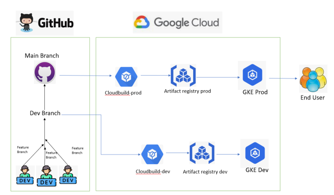

# This is a repo for our gcp devops project.
#### Enabled branch protection
In this project, we aim to streamline the Continuous Integration and Continuous Deployment (CI/CD) process by automating the deployment of a Python application from GitHub to Google Kubernetes Engine (GKE). By leveraging Google Cloud's powerful tools and services, particularly Cloud Build and GKE, we will create an efficient workflow that automates building, and deployment of our application.

